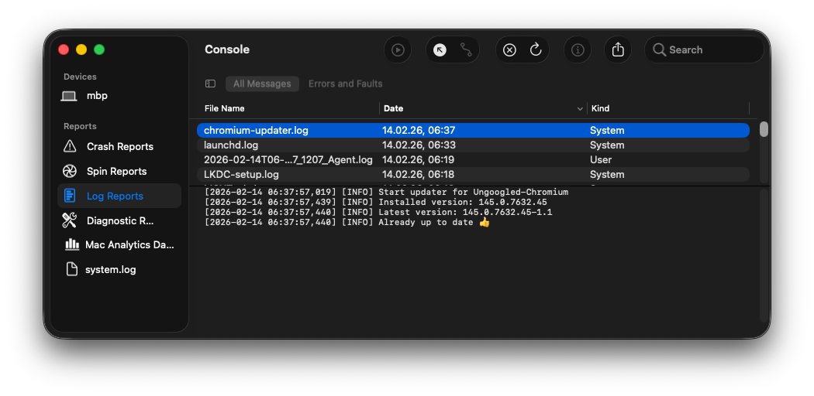

# Chromium updater for macOS

This is a LaunchDaemon to automatically update [Ungoogled Chromium](https://github.com/ungoogled-software/ungoogled-chromium-macos).

## Install updater

```bash
sudo cp -f src/chromium_updater.py /usr/local/bin/chromium-updater.py
sudo cp -f src/one.superbox.chromium.updater.plist /Library/LaunchDaemons/one.superbox.chromium.updater.plist
```

## Start LaunchDaemon

```bash
sudo launchctl bootstrap system /Library/LaunchDaemons/one.superbox.chromium.updater.plist
```

## Check if LaunchDaemon is running

```bash
launchctl list | grep chromium.updater
```

## View updater logs

```bash
tail -f /var/log/chromium-updater.log
```

or use the `console.app`:



## Stop LaunchDaemon

```bash
sudo launchctl bootout system /Library/LaunchDaemons/one.superbox.chromium.updater.plist
```
